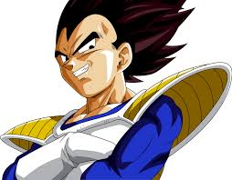
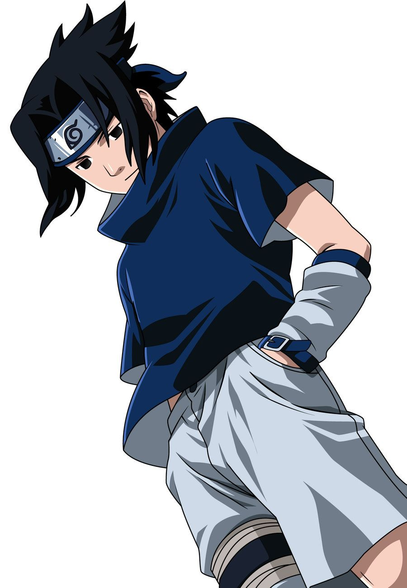

<h2 align="center">🇬🇧 Brazilian Electronic Ballot Box - 🇧🇷 Urna Eletrônica Brasileira</h2>

  🇬🇧 - a Brazilian Electronic Ballot Box whose protagonis... I mean candidates, are characters from Japanese Cartoons

  🇧🇷 - uma Urna Eletrônica brasileira que tem como protagonis... quero dizer candidatos personagens de Desenhos Animados Japoneses

<h2 align="center">🇬🇧 Available candidates
 - 🇧🇷 Candidatos disponíveis</h2>
 

  
  
Son Goku - Dragon Ball = 55555

  
  
Vegeta - Dragon Ball = 55123

  
  
Sakuta - Bunny Girl = 56666

  
  
Makinohara - Bunny Girl = 56023

  
  
Naruto Uzumaki - Naruto = 12796

  
  
Sasuke Uchiha - Naruto = 12751

  
  
Satoru Gojo - Jujutsu Kaisen = 90152

  
  
Yuji Itadori - Jujutsu Kaisen = 90034

